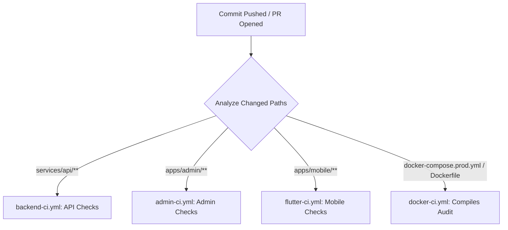
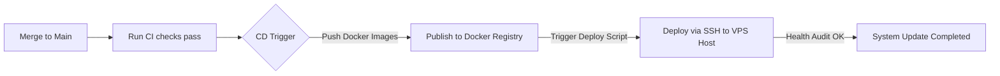

# Continuous Integration & Delivery (CI/CD) Architecture

This document describes the quality gates, validation rules, error diagnostics, and future deployment automation roadmap for the **Vital30 MVP monorepo** continuous integration pipeline.

---

## 🛠️ 1. GitHub Actions Workflow Pipelines

We have split the quality gates into four granular, paths-filtered pipelines located under `.github/workflows/`. This structure prevents unnecessary trigger executions, conserves GitHub runner minutes, and isolates failures to specific domains:



### A. Backend API CI (`backend-ci.yml`)
- **Triggers**: Pull requests and main push commits containing changes inside `services/api/**` or `.github/workflows/backend-ci.yml`.
- **Quality Checks Performed**:
  1. Installs exact locked packages using `npm ci`.
  2. Spawns isolated local **PostgreSQL** and **Redis** service containers on standard ports.
  3. Generates typesafe client bindings via `npx prisma generate`.
  4. Runs db migrations to check schema consistency: `npx prisma migrate deploy`.
  5. Performs code style checks: `npm run lint`.
  6. Runs all Jest unit specs: `npm run test`.
  7. Runs backend Jest contract E2E tests: `npm run test:e2e`.
  8. Audits NestJS compilation: `npm run build`.

### B. Admin Dashboard CI (`admin-ci.yml`)
- **Triggers**: Pull requests and main push commits containing changes inside `apps/admin/**` or `.github/workflows/admin-ci.yml`.
- **Quality Checks Performed**:
  1. Installs exact locked packages via `npm ci`.
  2. Runs static code linting: `npm run lint`.
  3. Executes automated Vitest unit/widget tests: `npm run test`.
  4. Confirms Vite packaging compiles cleanly without bundling errors: `npm run build`.

### C. Flutter Mobile CI (`flutter-ci.yml`)
- **Triggers**: Pull requests and main push commits containing changes inside `apps/mobile/**` or `.github/workflows/flutter-ci.yml`.
- **Quality Checks Performed**:
  1. Sets up the Flutter stable SDK with active file caches.
  2. Downloads pub dependencies: `flutter pub get`.
  3. Audits formatting guidelines: `dart format --set-exit-if-changed lib test`.
  4. Executes static analyzer check: `flutter analyze`.
  5. Runs all widget and unit test suites: `flutter test`.

### D. Docker Production Audit (`docker-ci.yml`)
- **Triggers**: Push commits on the `main` branch affecting Docker configurations, Nginx configs, or compose files.
- **Quality Checks Performed**:
  1. Compiles a mock environment profile.
  2. Assures `docker-compose.prod.yml` has a correct schema: `docker compose config`.
  3. Runs dry-run Docker builds on the API `Dockerfile` and Admin `Dockerfile` utilizing GHA caches to confirm compile readiness.

---

## 🔍 2. Diagnostic Log Audits & Resolving Failures

When a quality check fails, follow these steps to isolate and resolve the issue:

### Step 1: Identify the Failing Job
Navigate to the **Actions** tab on your GitHub repository page. Locate the specific workflow run marked with a red cross (`X`).

### Step 2: Read the Terminal Output
Open the failing workflow job and drill down into the step showing a red indicator:
- **Lint Errors**: If a lint step fails (e.g. ESLint or `flutter analyze`), inspect the reported line numbers. Resolve them by running `npm run lint` locally, or `dart format` / `flutter analyze` on your machine.
- **Test Failures**: Inspect the test assertions. Ensure that mocks have been configured properly (such as mocking external APIs or wrapping widgets under contexts).
- **Prisma Schema Failures**: If the `Apply DB Migrations` step fails, verify that your latest Prisma schema migrations (`prisma/migrations/**`) have been properly committed and align with local development states.

### Step 3: Run Validation Locally
Before pushing corrections, run the corresponding verification script locally to ensure a green build:
- **Backend API**: `npm run lint && npm run test && npm run test:e2e`
- **Admin App**: `npm run lint && npm run test`
- **Flutter App**: `dart format lib test && flutter analyze && flutter test`

---

## 🤝 3. Merging Guidelines

To preserve monorepo stability, enforce the following quality gate merging rules:

> [!IMPORTANT]
> **Strict Merge Requirements**:
> 1. **Green Quality Checks**: 100% of triggered CI workflows must pass successfully. A single red check blocks merge approvals.
> 2. **Pull Request Approval**: Minimum of 1 peer code review approval required.
> 3. **Clean Main Working Tree**: No developer commits may be made directly to `main` bypassing pull requests, unless they are automated chores (e.g. version locks).

---

## 🚀 4. Future Continuous Delivery (CD) Automation Plan

Once the MVP feature scope expands, we will transition from continuous integration (CI) to continuous delivery (CD) to automate releases onto our Hostinger VPS:



### Proposed CD Pipelines (Next Phase)
1. **Automated Docker Publishing**:
   - On successful merge to `main`, compile production Docker images, tag them with the corresponding commit SHA, and publish them to a private container registry (e.g. GitHub Packages or Docker Hub).
2. **Secure SSH Orchestration**:
   - Leverage a dedicated SSH Action (such as `appleboy/ssh-action`) utilizing encrypted GitHub Secrets keys (`VPS_SSH_PRIVATE_KEY`, `VPS_HOST_IP`) to securely log into the Hostinger VPS.
   - Run the deployment sequence automatically:
     ```bash
     cd /opt/vital30
     git pull origin main
     ./scripts/deploy-prod.sh
     ```
3. **Instant Slack / Discord Notifications**:
   - Integrate automated webhooks to notify the product team as soon as the live server health check returns `200 OK` on `https://api.vital30.com/health`.
