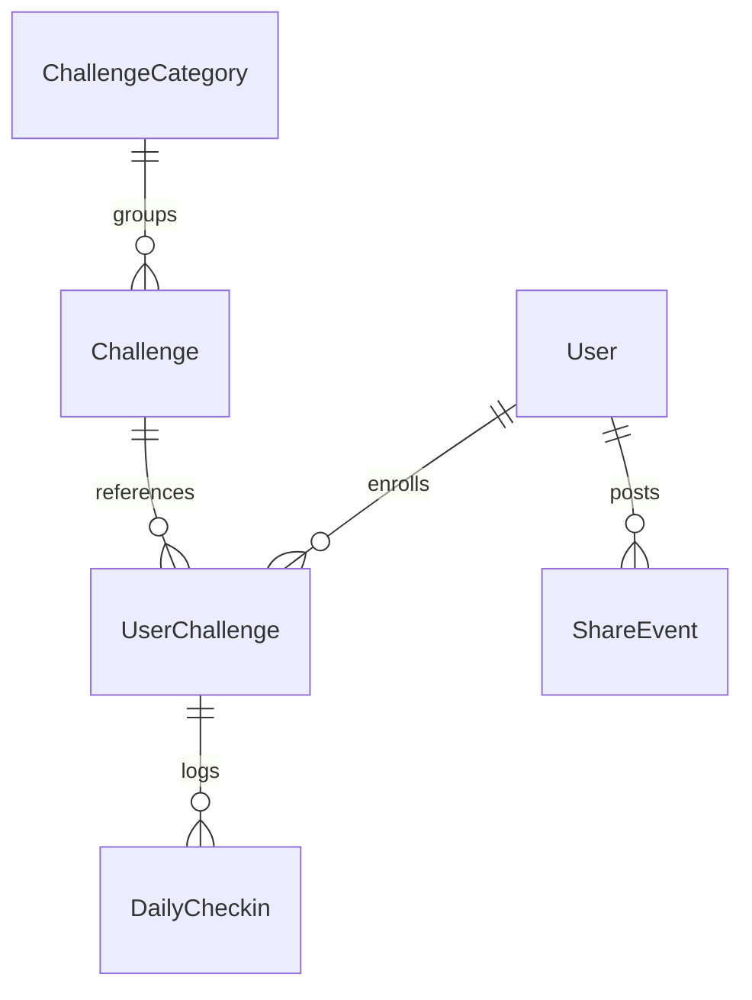
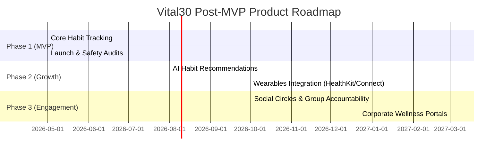

# Product Requirements Document (PRD) — Vital30 MVP

**Document Version:** 1.0.0  
**Status:** Approved  
**Author:** Vital30 Product & Engineering Team  
**Date:** May 25, 2026  

---

## 1. Product Overview

### A. Mission Statement
Vital30 is designed to make positive habit formation engaging, measurable, and sustainable. By breaking down general wellness into bite-sized, 30-day "blueprints" (challenges), Vital30 empowers users to build life-changing habits across physical, mental, and lifestyle domains.

### B. Core Philosophy
* **Consistency over Complexity**: We focus on single, manageable actions performed daily rather than complex, intimidating regimens.
* **Habits as Blueprints**: Pre-structured challenges remove decision fatigue, offering users an immediate path to action.
* **Zero Medical Pretentions**: Vital30 is strictly a **general wellness and habit challenge application**. It is **not** a medical device. It does not diagnose, treat, cure, manage, or prevent any illness or clinical condition, nor does it substitute professional medical consultation.

---

## 2. Target Users

Vital30 targets individuals seeking to build better daily habits but who are currently overwhelmed by complex regimens, lack structures, or struggle with consistency.

* **Busy Professionals**: Individuals trying to balance work and wellness (e.g., trying to stay hydrated, improve sleep hygiene, or sit less).
* **Wellness Novices**: People looking to start a fitness, diet, or mindfulness habit but needing simple, structured starting points.
* **Habit Restarters**: Individuals who have struggled to maintain consistency and need gamified tracking (streaks) and lightweight accountability.

---

## 3. MVP Goals

The Vital30 MVP focuses on providing a frictionless, single-user core habit loop that demonstrates early value, high retention potential, and flawless operational safety.

* **Establish Core Habit Loop**: Smooth user onboarding, challenge discovery, daily completion tracking, and streak measurement.
* **Validate Engagement Hook**: Evaluate user retention driven by streaks, progress grids, and frictionless sharing.
* **Flawless Safety Compliance**: Embed visible medical disclaimers, editable safety notes, and terms of service interfaces right at launch.
* **Data Privacy Excellence**: Protect user identifiers and habit data from day one, preparing the app for strict iOS and Android store reviews.

---

## 4. Non-Goals (Out of Scope for MVP)

To maintain focus and ensure a rapid, high-quality MVP launch, the following features are strictly **out of scope** (defined as Phase 2/3 roadmap items):

* ❌ **Artificial Intelligence & Recommendations**: No automated custom coaching, habit forecasting, or automated parsing of user notes (these will be loaded statically via server categories).
* ❌ **Social Groups & Community Chats**: No user-to-user private messages, community message boards, or public team challenges.
* ❌ **Voice Coaches & Audio Training**: No streaming workout audio, guided meditation voice-overs, or real-time running trackers.
* ❌ **Wearable Integrations**: No direct integrations with Apple HealthKit, Google Health Connect, Fitbit, or Garmin hardware (all check-ins are user-logged).

---

## 5. User Personas

To guide engineering and UX decisions, the MVP aligns around two core user personas:

### Persona A: "Sarah, the Busy Corporate Professional"
* **Demographics**: 32 years old, Marketing Director, resides in Chicago.
* **Goals**: Wants to drink more water, reduce evening screen time, and walk at least 8,000 steps daily.
* **Pain Points**: Suffers from constant screen fatigue and decision overload. Finds complex calorie counters and detailed exercise logs intimidating and tedious.
* **How Vital30 Wins**: Gives her a pre-structured, 30-day "Drink 3 Liters Daily" challenge. Onboarding takes less than 2 minutes, and check-ins require only 3 taps.

### Persona B: "David, the Wellness Novice"
* **Demographics**: 45 years old, Software Engineer, resides in Austin.
* **Goals**: Seeking a starting point to improve physical posture and reduce stress.
* **Pain Points**: Suffers from lower-back stiffness due to long desk hours. Often abandons habits after 3–4 days due to a lack of immediate visual progress trackers.
* **How Vital30 Wins**: Provides a "10-Minute Daily Stretch" beginner challenge, complete with specific safety precautions. A visual daily streak grid keeps him motivated and accountable.

---

## 6. User Stories

### A. General Users (Mobile App)
* **US-1.1 (Onboarding)**: As a new user, I want to register an account using my name, email, and password so that my progress syncs across my devices.
* **US-1.2 (Discovery)**: As an active user, I want to explore wellness challenges grouped by categories (Diet, Sleep, Fitness) so that I can find a habit that matches my personal goals.
* **US-1.3 (Blueprints)**: As a user, I want to view a challenge's full description, benefits, daily task, and safety notes before joining so that I know what to expect.
* **US-1.4 (Participation)**: As a user, I want to join a challenge so that it is added to my personal active list.
* **US-1.5 (Logging)**: As a active participant, I want to log my daily check-in (Completed, Missed, Skipped) with an optional text journal entry so that I can record my consistency.
* **US-1.6 (Progress)**: As a user, I want to view my streaks, completion rates, and historical calendar check-ins so that I feel motivated by my progress.
* **US-1.7 (Social)**: As a user, I want to share my check-in achievements or challenge milestones via external platform share sheets so that I can celebrate my consistency with friends.
* **US-1.8 (Safety)**: As a user, I want to access a dedicated, easily readable Health Disclaimer page from settings so that I can understand the safety boundaries of my active challenges.

### B. Administrators (Admin Web Dashboard)
* **US-2.1 (Categories)**: As an admin, I want to create, edit, activate, or deactivate wellness categories so that I can keep the discovery catalog organized.
* **US-2.2 (Challenges)**: As an admin, I want to manage challenges (assign category, edit descriptions, set difficulty, write safety precautions and benefits) so that the app catalog contains high-quality blueprints.
* **US-2.3 (Auditing)**: As an admin, I want to view registered user lists, active user challenges, check-in logs, and platform share events so that I can audit platform health and support inquiries.

---

## 7. Functional Requirements

### A. Challenge Discovery & Navigation
* The application must display challenges grouped by parent categories (e.g., Diet, Sleep, Fitness, Mental).
* Display badges indicating the target challenge difficulty (Beginner, Easy, Medium, Hard) and duration (default: 30 days).
* Display "Popular" and "Recommended" challenge groupings on the home screen dashboard.

### B. Challenge Join Flow
* Users can view full challenge details, key benefits, daily action tasks, and safety precautions before joining.
* A user can join multiple challenges concurrently.
* Once joined, a `UserChallenge` record is created, and the challenge is added to the user's active mobile feed.

### C. Daily Check-in & Streak Engine
* Users can log a daily status check-in once per calendar day per active challenge.
* Check-in statuses supported: `COMPLETED`, `MISSED`, `SKIPPED`.
* Users can optionally input a textual journal note with their daily check-in.
* Streaks (current and longest) are calculated automatically based on contiguous `COMPLETED` statuses.
* Skipped check-ins (`SKIPPED`) preserve active streaks but do not increment the count. Missed check-ins (`MISSED`) break the active streak.

### D. Status Sharing
* Triggered manually from the mobile app.
* Generates standard text summaries (e.g., *"I just checked in for Day 12 of my 30-Day Hydration challenge on Vital30! Join me!"*).
* Forwards the text payload to the native OS share sheet (via `share_plus`) to post on external applications.

---

## 8. Non-Functional Requirements

### A. Performance & Latency
* **API Response Time**: 95% of standard GET requests to the NestJS API must resolve in `< 200ms` under normal load conditions.
* **Mobile Boot Time**: The Flutter application must boot to the main welcome or authenticated home page in `< 2.5 seconds` on modern iOS and Android devices.

### B. Scalability & Availability
* The backend must be deployable inside isolated Docker containers, leveraging Nginx reverse proxies and PostgreSQL connection pools.
* The system should support up to 5,000 active daily users on standard Hostinger KVM 4 single-instance VPS hardware configurations.

### C. Reliability & Fallbacks
* If API endpoints fail or are unreachable, the React Admin dashboard must fallback gracefully to fully interactive in-memory datasets, printing developer warnings without crashing.
* The Flutter app must leverage standard `dio` interceptors to notify the user of connectivity issues without breaking stored local navigation states.

---

## 9. Admin Requirements

Administrators manage the platform via a React-based single-page application (SPA):

* **Authentication**: Secured via JWT tokens saved in localStorage. Protected routing blocks unauthenticated visitors.
* **Main Dashboard**: Displays platform-wide KPIs: Total Users, Active Challenges, Active User Enrollments, Check-in Counts, and Share Events. Includes a visual categorization breakdown using Recharts.
* **Challenge Management Form**:
  * Fields: Title, Slug (Unique), Category, Short Description, Detailed Description, Difficulty, Duration (Days), Daily Action Task, Benefits (dynamic bullet array), and **Expandable Safety Note Textarea**.
  * Administrative actions: Save, Edit, Activate, Deactivate, Toggle Popular status, Toggle Recommended status.
* **Category Form**:
  * Fields: Name, Slug (Unique), Description, Icon identifier.
* **User Audit Panel**: Lists registered users and details their active enrollments, history, and individual check-in logs.

---

## 10. Mobile Requirements

The mobile app must deliver a premium, fluid native experience on both iOS and Android:

* **Theme & Branding**: Modern slate gray background (`#1E293B`) for splash screens, clean emerald/mint highlights (`#10B981`) for wellness success components, and readable sans-serif typography.
* **Routing Architecture**: Standard nested tab navigation managed via `go_router`. Authenticated guards redirect unauthenticated bootups to `/welcome`.
* **State Management**: Robust, decoupled states using `flutter_riverpod` providers. Secure token storage managed via `flutter_secure_storage`.
* **Required Screens**:
  1. **Welcome Screen**: Clean branding layout linking to Login and Register.
  2. **Auth (Register & Login)**: Pristine input forms with live validation.
  3. **Home View**: Active challenges panel, popular blueprints, categories tiles.
  4. **Categories View**: Complete list of wellness categories.
  5. **Challenge List Screen**: Filtered catalog blueprints.
  6. **Challenge Detail Card**: Detailed daily action, benefits, and safety warnings. Includes an orange-accented medical warning box.
  7. **Daily Check-in Modal**: Large touch targets for Completed/Missed/Skipped with dynamic text journal field.
  8. **Progress View**: Streaks dashboard, completion metrics, and interactive check-in calendar grid.
  9. **Profile & Settings**: User details card, app version, interactive Privacy Policy, Terms, and a dedicated scrollable **Health Disclaimer Screen**.

---

## 11. Backend Requirements

Built on a highly maintainable, modular NestJS framework:

* **Database Client**: Type-safe queries using Prisma ORM.
* **API Services**: Completely separated controllers, services, DTOs, and schema repositories.
* **Migrations System**: Fully automated migrations tracking Postgres table modifications, primary keys, and index updates.
* **Health Monitoring**: Dedicated `/health` endpoint validating database and cache status for deployment container orchestrators.

---

## 12. Data Model Summary (PostgreSQL Schema)

The PostgreSQL database uses UUID primary keys and standard indexing. Key relations are summarized below:

### A. Enums
* **`UserRole`**: `USER`, `ADMIN`, `SUPER_ADMIN`
* **`ChallengeDifficulty`**: `BEGINNER`, `EASY`, `MEDIUM`, `HARD`
* **`UserChallengeStatus`**: `ACTIVE`, `COMPLETED`, `ABANDONED`
* **`CheckinStatus`**: `COMPLETED`, `MISSED`, `SKIPPED`
* **`ShareType`**: `CHALLENGE_INVITE`, `DAILY_PROGRESS`, `COMPLETION`

### B. Core Database Models

#### `User`
* `id`: UUID (Primary Key)
* `email`: String (Unique, Indexed)
* `password`: String (Hashed)
* `name`: String
* `role`: `UserRole` (Default: `USER`)
* `createdAt` / `updatedAt`: DateTime

#### `ChallengeCategory`
* `id`: UUID (Primary Key)
* `name`: String
* `slug`: String (Unique, Indexed)
* `description`: String
* `createdAt` / `updatedAt`: DateTime

#### `Challenge`
* `id`: UUID (Primary Key)
* `title`: String
* `slug`: String (Unique, Indexed)
* `shortDescription`: String
* `description`: String
* `durationDays`: Int (Default: 30)
* `difficulty`: `ChallengeDifficulty` (Default: `EASY`)
* `dailyTask`: String
* `benefits`: String[]
* `safetyNote`: String (Optional)
* `categoryId`: UUID (Foreign Key -> `ChallengeCategory`)
* `isActive`: Boolean (Default: true)
* `isPopular`: Boolean (Default: false)
* `isRecommended`: Boolean (Default: false)
* `createdAt` / `updatedAt`: DateTime

#### `UserChallenge`
* `id`: UUID (Primary Key)
* `userId`: UUID (Foreign Key -> `User`, Indexed)
* `challengeId`: UUID (Foreign Key -> `Challenge`)
* `status`: `UserChallengeStatus` (Default: `ACTIVE`)
* `startDate`: DateTime
* `endDate`: DateTime
* `currentStreak`: Int (Default: 0)
* `longestStreak`: Int (Default: 0)
* `createdAt` / `updatedAt`: DateTime

#### `DailyCheckin`
* `id`: UUID (Primary Key)
* `userChallengeId`: UUID (Foreign Key -> `UserChallenge`, Indexed)
* `checkinDate`: Date (Unique combination with `userChallengeId`)
* `status`: `CheckinStatus`
* `notes`: String (Optional)
* `createdAt` / `updatedAt`: DateTime

#### `ShareEvent`
* `id`: UUID (Primary Key)
* `userId`: UUID (Foreign Key -> `User`)
* `shareType`: `ShareType`
* `payload`: String
* `createdAt`: DateTime

---

## 13. Security Requirements

* **Authentication**: JWT tokens signed using high-entropy HS256 keys on the NestJS API.
* **Token Storage**: Hashed and stored in iOS Keychain / Android Keystore using `flutter_secure_storage` on mobile devices.
* **Network Encryption**: 100% of external traffic encrypted in transit via SSL/TLS (`https` for API, `wss` for secure sockets) behind hard-coded Nginx proxies.
* **Database Isolation**: PostgreSQL and Redis services are locked inside local Docker networks, exposing zero external ports to the public internet. Access is restricted to internal api containers.
* **Cross-Origin Security**: NestJS CORS filters explicitly restrict origins to `admin.challenge.charangudla.com` and the mobile app's API client wrappers.

---

## 14. Privacy Requirements

* **No Data Sale**: The application explicitly prohibits the sharing, rental, or sale of user emails, habit histories, or tech identifiers with data brokers or advertising networks.
* **Data Deletion Compliance**: In compliance with GDPR and App Store Guidelines, the application supports complete data erasure. Users can request account deletion in-app or via support emails, triggering cascades to permanently wipe all User, UserChallenge, DailyCheckin, and active session tokens within 30 days.
* **Future AI Readiness**: The Privacy Policy clearly states that future AI personalization features are **not active** in the MVP, protecting early users and establishing clear consent boundaries for future rollouts.

---

## 15. QA Acceptance Criteria

Before any candidate is approved for app store submission, the following testing criteria must be satisfied:

* **API Unit Tests**: The backend NestJS unit/integration suites must achieve `> 80%` code coverage with 100% passing tests.
* **Mobile UI / Widget Tests**: Flutter widget tests must pass cleanly, validating correct streak progression math, social share text packaging, and welcome screen routing.
* **TypeScript & Lint Audits**: Running `npm run typecheck` and `npm run lint` inside the React Admin dashboard must resolve with **zero warnings or compile-time failures**.
* **Database Constraints**: Verify that unique database constraints (e.g., unique `DailyCheckin` per `userChallengeId` + `checkinDate`) prevent double logging.

---

## 16. Release Criteria

The MVP release candidate is considered ready for public deployment only when:

1. **Compilation Passes**: Clean production builds generated successfully (`flutter build appbundle --release` and `flutter build ipa --release`).
2. **Branding Assets Placed**: Launcher icons are visible at all native scaling DPI targets, and the splash screen loads a dark slate gray brand background.
3. **Public Policies Online**: Privacy policies, terms of service, and health disclaimers are publicly hosted and correctly linked inside the mobile profile tab settings.
4. **Zero Medical Claims**: Complete audit validates that no text, description, or challenge name implies clinical diagnostics or disease treatment, preventing app review rejection.

---

## 17. Future Roadmap (Post-MVP Phases)

Vital30 is designed to scale dynamically into a premier, premium wellness habit ecosystem. The post-MVP roadmap is detailed below for investors and developers:

### 🚀 Phase 2: AI Habits & Wearables (Personalization & Growth)
* **AI Recommendation Engine**: Dynamically analyzes user completion streaks and check-in times to suggest optimal challenges (e.g., recommending stress reduction habits to users struggling with sleep logs).
* **Smart Wearable Synchronizations**: Direct integrations with Apple HealthKit, Google Health Connect, and Garmin to automate daily check-ins (e.g., checking in the "Walk 10k Steps" challenge automatically upon reading pedometer data).
* **Voice-Over Guided Wellness**: Audio-guided stretching, meditations, and breathing guides inside the mobile challenge detail card.

### 🌟 Phase 3: Social & B2B Wellness (Community & Scaling)
* **Social circles**: Interactive family/friend wellness groups, shared completion goals, and high-five emojis to gamify team accountability.
* **Corporate Wellness Portal**: Subscriptions for enterprise HR departments, enabling companies to launch corporate-wide 30-day habits (e.g., "Daily Desk Stretches") with aggregate team completion reports.
